# Create a Slot Feature in FeatureScript

In this series of tutorials, we will create a slot feature, designed for joining two laser-cut parts. Eventually, we will use this feature to make large assemblies of laser-cuttable parts which are joined with slot features.

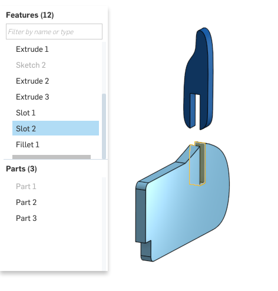
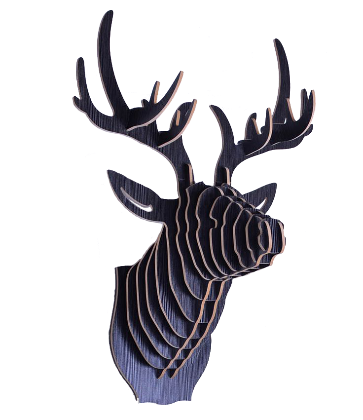

The slot feature is just one example of what FeatureScript can do, but each tutorial in the series introduces concepts which can be applied to a wide variety of features.

In the first tutorial, we'll walk through how to:

 - Create a new "Slot" feature type
 - Specify the feature's inputs
 - Define the feature's behavior
 - Use instances of the feature in a Part Studio
 
## Motivation

A slot is simple to create with or without using FeatureScript. However, encapsulating the behavior in a custom feature provides some key advantages:

#### Interface control:

With FeatureScript, we can fully specify the feature dialog interface, and optimize the workflow. In this tutorial, our feature's input will include the sketched path, but in future tutorials, we improve this interface so that we can create a pair of slots with just two selections.

#### Update everywhere:

Each instance of a "Slot" feature points to the same feature definition, so each time we improve our slot feature, every instance in the document is immediately updated. When using features from a different document, a user can update by repointing their document to any published version of the feature.

#### Error handling:

When invalid inputs are entered, errors can be reported to help diagnose what's wrong. With this workflow, the end user will immediately see if they've made a slot that won't fit, or won't laser cut: reported errors will turn a feature red in the feature tree.

#### Quality assurance:

Your features will have more knowledge about their purpose than generic Onshape features, so their specific edge cases can be handled better. This, in combination with error handling, can mean the end user is less likely to make mistakes.

## Video overview

This video shows the creation of the slot feature. It demonstrates what a FeatureScript workflow can look like, and creates the same "Slot" feature type that the tutorial will guide you through below.

## Step-by-step guide

This guide will take you step by step through the actions shown in the video above, explaining what the FeatureScript does and why. Major FeatureScript concepts will be marked in __bold__ when they are explained.

### Create a feature definition

#### 1

Start by creating a new Feature Studio tab in a new Onshape document:

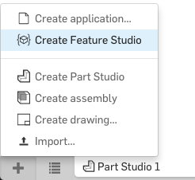

A Feature Studio is a place for editing FeatureScript where you can define functions to be used as __feature types__. All of Onshape's native feature types, from extrude to helix, are also written as FeatureScript feature types in the [Onshape Standard Library](https://cad.onshape.com/documents/12312312345abcabcabcdeff). Custom feature types that you write here will be treated like Onshape feature types in the Part Studio.

#### 2

In the Feature Studio, in the top-left corner, click the "New feature" button.

This will insert the following code, which is the minimum template for defining an empty feature type:

```javascript
annotation { "Feature Type Name" : "My Feature" }
export const myFeature = defineFeature(function(context is Context, id is Id, definition is map)
    precondition
    {
        // Define the parameters of the feature type
    }
    {
        // Define the function's action
    });
```

For more information about the structure and pieces of a feature definition, see [Writing features](https://cad.onshape.com/FsDoc/feature-types.html).

#### 3

After pressing the "New feature" button, you should see the text `"My Feature"` highlighted. This field is a [string](https://cad.onshape.com/FsDoc/variables.html#strings) which defines the user-visible name of the feature type. This name is seen when a user inserts the feature, and in default feature names (e.g. "Extrude 1"). The feature type name can include whitespace, and can be changed at any time without affecting Part Studios' behavior or other FeatureScript code.

Change the feature type name to `"Slot"`:

```javascript
annotation { "Feature Type Name" : "Slot" }
```

#### 4

Select the text `myFeature` on the next line (with autocomplete regions, you can press `tab` to select the next field). This is the FeatureScript name of this feature function. The function name is used by any FeatureScript calls that create this feature, *including features created in the Part Studio*. Thus, changing this name after creating features will break all features created with the old name. This name cannot include whitespace or special characters.

Change the FeatureScript function name to "`slot`":

```javascript
export const slot = defineFeature(function(context is Context, id is Id, definition is map)
```

Your Feature Studio should now look like this (but with a different FeatureScript version and import version):

```javascript
FeatureScript 765;
import(path : "onshape/std/geometry.fs", version : "765.0");

annotation { "Feature Type Name" : "Slot" }
export const slot = defineFeature(function(context is Context, id is Id, definition is map)
    precondition
    {
        // Define the parameters of the feature type
    }
    {
        // Define the function's action
    });
```

### Define the feature's input parameters

#### 1

Select the next region: "`// Define the parameters of the feature type`". This section of code, between the two curly braces, is the function's precondition. The precondition is used, in part, to define a feature's input parameters. The text highlighted is a comment, which does not affect FeatureScript evaluation.

Delete this comment:

```javascript
// Define the parameters of the feature type
```

#### 2

Our feature's first input parameter will be an edge which defines the slot path. Input parameters to features are stored in its `definition`: a map whose keys are strings. These parameters can later be accessed from the `definition` to define how the feature should be built.

All geometry in FeatureScript is passed into features as `Query`s, so we will define a query parameter.

Start typing "`query`". The autocompletion menu will expand below your cursor as you type. One of the autocompletions you should be able to see is "Query parameter", a snippet of code which, when placed in a feature precondition, defines a query parameter.

Use the arrow keys (if necessary) to select the "Query parameter" snippet, and press enter to insert the autocompletion. This will insert the following code:

```javascript
annotation { "Name" : "My Query", "Filter" : EntityType.FACE, "MaxNumberOfPicks" : 1 }
definition.myQuery is Query;
```

After inserting the Query parameter autocompletion, you should see the text `"My Query"` highlighted. This is the user-visible name of the parameter. Query parameter names are visible in the feature dialog when the field is empty.

Change the user-visible parameter name to `"Slot path"`:

```javascript
annotation { "Name" : "Slot path", "Filter" : EntityType.FACE, "MaxNumberOfPicks" : 1 }
definition.myQuery is Query;
```

Select the next region: "`EntityType.FACE`". This field represents a filter that controls which geometric entities can be accepted by the parameter. You can filter by `EntityType`, `GeometryType`, `BodyType`, and more.

To allow only edges, change the filter to "`EntityType.EDGE`":

```javascript
annotation { "Name" : "Slot path", "Filter" : EntityType.EDGE, "MaxNumberOfPicks" : 1 }
definition.myQuery is Query;
```

Select the next region: "`1`". This field represents the maximum number of selections the user can make in this field. This field can also be removed to allow infinite selections.

To allow just one edge selection, leave the default of `1`:

```javascript
annotation { "Name" : "Slot path", "Filter" : EntityType.EDGE, "MaxNumberOfPicks" : 1 }
definition.myQuery is Query;
```

Select the next region: "`myQuery`". This is the FeatureScript-visible name of this parameter, which will later be used to access this parameter within the function's body. The value of this parameter is stored as a Query on a map named "`definition`".

Change the FeatureScript parameter name to "`slotPath`":

```javascript
annotation { "Name" : "Slot path", "Filter" : EntityType.FACE, "MaxNumberOfPicks" : 1 }
definition.slotPath is Query;
```

#### 3

The second parameter will define the part to cut. Since this parameter will also take in model geometry, we will use another query parameter.

On the line after the slot path parameter, start typing "`query`", and select the autocompletion for "Query parameter":

```javascript
annotation { "Name" : "My Query", "Filter" : EntityType.FACE, "MaxNumberOfPicks" : 1 }
definition.myQuery is Query;
```

Fill out its fields with the following:

```javascript
annotation { "Name" : "Part to cut", "Filter" : EntityType.BODY && BodyType.SOLID, "MaxNumberOfPicks" : 1 }
definition.partToCut is Query;
```

#### 4

The final feature parameter will define the width of the slot. Since this parameter is a one-dimensional distance, we will use a length parameter.

On the line after the slot path parameter, start typing "length", and select the autocompletion for "Length parameter":

```javascript
annotation { "Name" : "My Length" }
isLength(definition.myLength, LENGTH_BOUNDS);
```

Fill out its fields to name the parameter:

```javascript
annotation { "Name" : "Width" }
isLength(definition.width, LENGTH_BOUNDS);
```

Add blank lines between the parameters for code readability. Your final precondition should now look as follows:

```javascript
precondition
{
    annotation { "Name" : "Slot path", "Filter" : EntityType.EDGE, "MaxNumberOfPicks" : 1 }
    definition.slotPath is Query;

    annotation { "Name" : "Part to cut", "Filter" : EntityType.BODY && BodyType.SOLID, "MaxNumberOfPicks" : 1 }
    definition.partToCut is Query;

    annotation { "Name" : "Width" }
    isLength(definition.width, LENGTH_BOUNDS);
}
```

### Create an instance of your feature

#### 1

To commit the changes you've made to your Feature Studio, press the "Commit" button in the FeatureScript toolbar.

#### 2

Switch to *Part Studio 1*. In this Part Studio, make some geometry that the slot feature can be tested on. Create a sketch with internal, perpendicular edges, like the one below, and extrude it:

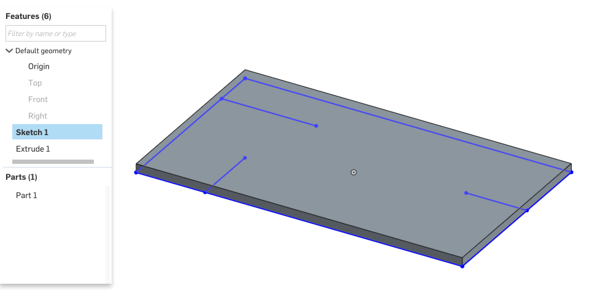

#### 3

You should see a new icon in the toolbar for your new custom "Slot" feature. This dropdown menu will show all the custom feature types defined in this workspace.

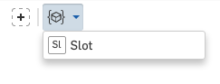

The name "Slot" seen here comes from the "Feature Type Name" you defined in the Feature Studio earlier. The icon for the feature is created automatically with the first two letter of that name.

#### 4

Click the Slot feature button. This will pull up a feature dialog for your feature. If your precondition is written correctly, this feature dialog should look like this:

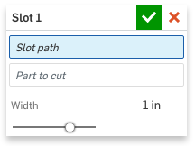

#### 5

As input to your feature, choose an internal edge for the slot, choose the extruded part as the part to cut, and set the width to "3mm".

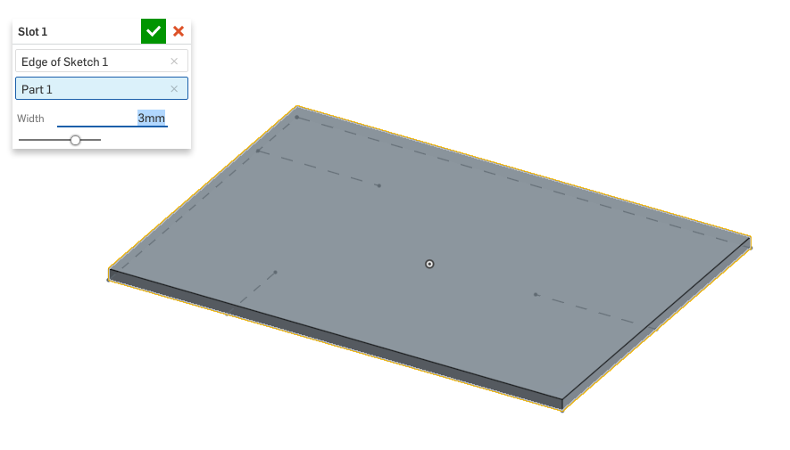

### Define the Feature's behavior

The feature you created currently has no effect because the body of the feature function is empty. A feature function body is a block of code which will execute for each feature of this type, every time a Part Studio is regenerated.

In this section, we will define following operations in the function body to create the slot:

 - __Extrude__ the slot edge as a surface.
 - __Thicken__ the surface.
 - __Subtract__ the result from the part to cut.

Because these operations are wholly contained within the Slot feature, the end user will not see these operations in their feature tree: just a single feature named e.g. "Slot 1". The feature will also clean up after itself, so the end user will never see any intermediate geometry created.

#### 1

Switch back to the Feature Studio. In the feature's body (between the second pair of braces), there should still be a comment saying "`// Define the function's action`".

Delete this comment:

```javascript
// Define the function's action
```

#### 2

The first operation will extrude the sketch edge.

In the feature's body, type "`opExtrude`", and select the autocompletion for the `opExtrude` function.

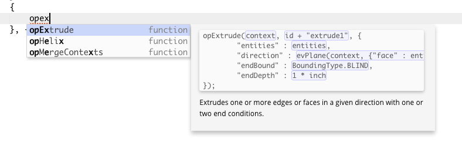

This will insert the following code:

```javascript
opExtrude(context, id + "extrude1", {
        "entities" : entities,
        "direction" : evOwnerSketchPlane(context, {"entity" : entities}).normal,
        "endBound" : BoundingType.BLIND,
        "endDepth" : 1 * inch
});
```

After insertion, you should see the parameter "`context`" highlighted. This is the `Context`, a data structure which contains all geometry in the Part Studio. Almost always, your features will involve a single `Context` named "`context`", passed in from the Part Studio. Here, we pass it on to the `opExtrude` function so that `opExtrude` can create geometry in the Part Studio.

The default autocompletion of "`context`" makes sense, so leave it.

```javascript
opExtrude(context, id + "extrude1", {
        "entities" : entities,
        "direction" : evOwnerSketchPlane(context, {"entity" : entities}).normal,
        "endBound" : BoundingType.BLIND,
        "endDepth" : 1 * inch
});
```

With the tab key or the mouse, select the next parameter: `id + "extrude1"`. This is the `Id`, a unique identifier for the extrude operation being performed.

The default `Id` is already unique and descriptive, so leave it.

```javascript
opExtrude(context, id + "extrude1", {
        "entities" : entities,
        "direction" : evOwnerSketchPlane(context, {"entity" : entities}).normal,
        "endBound" : BoundingType.BLIND,
        "endDepth" : 1 * inch
});
```

Select the text next to the `"entities"` field. This field defines what geometry should be extruded. We want to extrude the sketch edge passed in. This edge is stored on on the `definition` as `slotPath`, as we defined in the precondition.

Change the `"entities"` field to `definition.slotPath`:

```javascript
opExtrude(context, id + "extrude1", {
        "entities" : definition.slotPath,
        "direction" : evOwnerSketchPlane(context, {"entity" : entities}).normal,
        "endBound" : BoundingType.BLIND,
        "endDepth" : 1 * inch
});
```

Select the text next to the `"direction"` field. This field defined what direction to extrude in. We want this feature to extrude the surface perpendicular to the sketch normal.

The default autocompletion makes a call to `evOwnerSketchPlane` get the correct direction vector. We want to do the same, but instead evaluate the owner sketch of the `slotPath`.

```javascript
opExtrude(context, id + "extrude1", {
        "entities" : definition.slotPath,
        "direction" : evOwnerSketchPlane(context, {"entity" : definition.slotPath}).normal,
        "endBound" : BoundingType.BLIND,
        "endDepth" : 1 * inch
});
```

Press tab to select the text next to the `"endBound"` field. This field specifies a `BoundingType`: one of `BLIND`, `SYMMETRIC`, `THROUGH_ALL`, etc.

Change the endBound to "`BoundingType.THROUGH_ALL`":

```javascript
opExtrude(context, id + "extrude1", {
        "entities" : definition.slotPath,
        "direction" : evOwnerSketchPlane(context, {"entity" : definition.slotPath}).normal,
        "endBound" : BoundingType.THROUGH_ALL,
        "endDepth" : 1 * inch
});
```

Press tab to select the text next to the `"depth"` field. Since we've chosen a `THROUGH_ALL` extrude, this field isn't necessary.

Delete the entire depth parameter:

```javascript
opExtrude(context, id + "extrude1", {
        "entities" : definition.slotPath,
        "direction" : evOwnerSketchPlane(context, {"entity" : definition.slotPath}).normal,
        "endBound" : BoundingType.THROUGH_ALL,
});
```

In its place, we will specify that the `startBound` of the extrude should also be `THROUGH_ALL`.

This addition gives us some extra robustness in making sure the slot cuts properly. In the one instance we've made in a Part Studio, we defined the slot sketch on the bottom surface of the part, so the sketch normal points directly into the part. However, we want this feature to still work if a user puts a sketch on the top surface, or in the center, or even off of the part.

Add the field `"startBound" : BoundingType.THROUGH_ALL` as the last field in the `opExtrude` call:

```javascript
opExtrude(context, id + "extrude1", {
        "entities" : definition.slotPath,
        "direction" : evOwnerSketchPlane(context, {"entity" : definition.slotPath}).normal,
        "endBound" : BoundingType.THROUGH_ALL,
        "startBound" : BoundingType.THROUGH_ALL
});
```

Press the commit button. At this point, your FeatureScript notices panel should be free of errors.

If you switch back to the Part Studio, you should see a surface extruded from the edge in your slot feature in two directions:

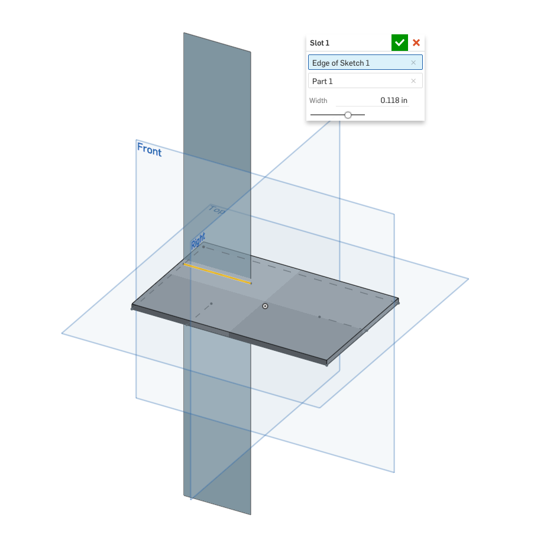

#### 3

The next operation will thicken the surface to the slot width.

After the `opExtrude` call, type and select the autocompletion for `opThicken`. This will insert the following code:

```javascript
opThicken(context, id + "thicken1", {
        "entities" : entities,
        "thickness1" : 0.1 * inch,
        "thickness2" : 0.1 * inch
});
```

For this operation, the `context` should be left as "`context`", as usual. The Id default of "`id + "thicken1"`" is unique and descriptive, so leave that too.

The `"entities"` should specify the surface to thicken. Specify a query for the surface we just created using `qCreatedBy`, passing in the `id` of the first `opExtrude`:

```javascript
opThicken(context, id + "thicken1", {
        "entities" : qCreatedBy(id + "extrude1", EntityType.BODY),
        "thickness1" : 0.1 * inch,
        "thickness2" : 0.1 * inch
});
```

`"thickness1"` and `"thickness2"` specify how much to thicken on each side of the surface. Let's make the slot symmetric, and thicken each side by half the slot width:

```javascript
opThicken(context, id + "thicken1", {
        "entities" : qCreatedBy(id + "extrude1", EntityType.BODY),
        "thickness1" : definition.width / 2,
        "thickness2" : definition.width / 2
});
```

Press the commit button. In your Part Studio, you should see the thickened surface: a new solid body in your `Context`.

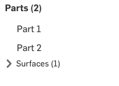 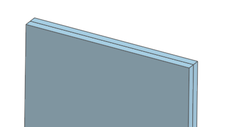

The `opThicken` operation did not delete the original extruded surface, so let's clean that up now. Type and select the autocompletion for `opDeleteBodies`. This will insert:

```javascript
opDeleteBodies(context, id + "deleteBodies1", {
        "entities" : entities
});
```

Leave the default `Context` and `Id`, and set the `"entities"` to "`qCreatedBy(id + "extrude1", EntityType.BODY)`", the same query for the surface body created by the `opExtrude`:

```javascript
opDeleteBodies(context, id + "deleteBodies1", {
        "entities" : qCreatedBy(id + "extrude1", EntityType.BODY)
});
```

In your Part Studio, you should see the extruded surface disappear, but the new thickened body should still be present:

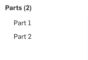 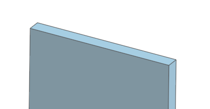

The final operation will subtract the thickened surface from the specified `"Part to cut"`. Type and select the autocompletion for `opBoolean`:

```javascript
opBoolean(context, id + "boolean1", {
        "tools" : tools,
        "operationType" : BooleanOperationType.UNION
});
```

Leave the default `Context` and `Id`, and set the following parameters:

`"tools"`, the parts to subtract, should be the result of the Thicken operation: "`qCreatedBy(id + "thicken1", EntityType.BODY)`"
`"targets"`, the parts to be cut, should be set to the part set on the definition: "`definition.partToCut`"
`"operationType"`, the boolean operation to perform, should be "`BooleanOperationType.SUBTRACTION`"

```javascript
opBoolean(context, id + "boolean1", {
        "tools" : qCreatedBy(id + "thicken1", EntityType.BODY),
        "targets" : definition.partToCut,
        "operationType" : BooleanOperationType.SUBTRACTION
});
```

In your Part Studio, you should now see the slot correctly cut out of your part, and the thickened body deleted:

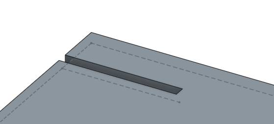

Congratulations! You've just completed your first FeatureScript feature.

Feel free to play around with the feature. The slot feature function will be called again (i.e. regenerated) every time you change a slot feature's parameters, or change a feature upstream of a slot feature in the feature tree. After you update a Feature Studio and commit your changes, dependent Part Studios will also be regenerated.

Try creating test cases for this feature. Where does the feature succeed? Where does it not do what you expect? How could the design be improved?

## Review

In this tutorial, we've discussed how to:

 - Create a new __feature type__
 - Define `definition` __parameters__
 - Filter for different kinds of geometry by __`EntityType`__ and __`BodyType`__
 - Modify geometry with __operations__
 - Keep track of operations and features with hierarchical __`Id`s__
 - Get geometrical information from entities with __evaluations__
 - Specify geometry with __`Query`s__
 - Update other tabs via __commit__
 - Add code quickly with the __autocomplete menu__
 - Navigate inserted code with __autocomplete regions__

In the next tutorials, we will cover more FeatureScript topics while refactoring the way our slot feature is created and improving its behavior.

## Final feature code

Included here is the final code written in this tutorial. Note that your FeatureScript version and Onshape Standard Library version may be different.

```javascript
FeatureScript 765;
import(path : "onshape/std/geometry.fs", version : "765.0");

annotation { "Feature Type Name" : "Slot" }
export const slot = defineFeature(function(context is Context, id is Id, definition is map)
    precondition
    {
        annotation { "Name" : "Slot path", "Filter" : EntityType.EDGE, "MaxNumberOfPicks" : 1 }
        definition.slotPath is Query;

        annotation { "Name" : "Part to cut", "Filter" : EntityType.BODY && BodyType.SOLID, "MaxNumberOfPicks" : 1 }
        definition.partToCut is Query;

        annotation { "Name" : "Width" }
        isLength(definition.width, LENGTH_BOUNDS);
    }
    {
        opExtrude(context, id + "extrude1", {
               "entities" : definition.slotPath,
               "direction" : evOwnerSketchPlane(context, {"entity" : definition.slotPath}).normal,
               "endBound" : BoundingType.THROUGH_ALL,
               "startBound" : BoundingType.THROUGH_ALL
        });

        opThicken(context, id + "thicken1", {
               "entities" : qCreatedBy(id + "extrude1", EntityType.BODY),
               "thickness1" : definition.width / 2,
               "thickness2" : definition.width / 2
        });

        opDeleteBodies(context, id + "delete1", {
               "entities" : qCreatedBy(id + "extrude1", EntityType.BODY)
        });

        opBoolean(context, id + "boolean1", {
               "tools" : qCreatedBy(id + "thicken1", EntityType.BODY),
               "targets" : definition.partToCut,
               "operationType" : BooleanOperationType.SUBTRACTION
        });

    });
```
