# Add sketch geometry

In this tutorial, we will rewrite the body of the slot feature created in the [last tutorial](../tutorial-1/). The new version will involve a sketch which creates more complex geometry.

This tutorial will walk through how to:

 - Robustly calculate the right coordinate system for sketching
 - Create a sketch and add sketch entities
 - Specify a sketch region to extrude and subtract
 
We'll also discuss some core FeatureScript concepts along the way, like using variables, doing geometric calculation, debugging geometry, and diagnosing errors.

## Motivation

Laser cut slots, like the ones made in the last tutorial, require very tight tolerances. The difference between a press fit too loose to hold together and a press fit too tight to assemble can be as little as ±0.005". When working with laser-cut materials, there is generally very low variability in the dimensions of the laser-cut profile (a well-focused beam's cut width can vary less 0.001" between jobs), but there will be high variability in the thickness of the material itself (high-quality 1/8" plywood, for example, can still vary in thickness by ±0.015").

One way to increase the tolerance of this fit is to add geometry to the slot that compresses more readily and provides less friction than a flat wall, like the design below:

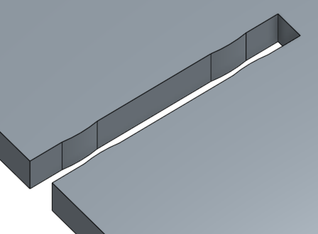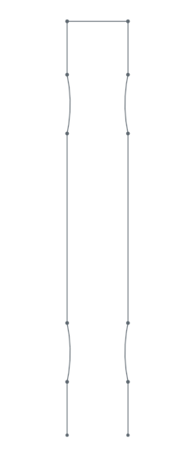

On oversized material, these protrusions will compress slightly to allow the materials to slide together with much less friction than a standard slot. For undersized materials, these protrusions will compress less, but still provide a secure fit at both ends.

Without FeatureScript, making many slots with geometry like this requires a lot of repetitive work. With FeatureScript, we can build this additional geometry inside the slot feature so it can automatically be a part of any slot we create.

Add parameters to the precondition
We'll start by adding two new parameters to our slot feature, asking the user:

1. Do you want to add these bumps?
2. If so, how big?

At the end of the slot feature's precondition, add a boolean parameter named `addBumps`:

```javascript
annotation { "Name" : "Add bumps" }
definition.addBumps is boolean;
```
A __conditional parameter__ (i.e. a parameter whose visibility is controlled by other parameters) can be defined inside the precondition using an `if` statement.

Let's add a new parameter named `bumpHeight`, conditional on `addBumps` being true:

```javascript
if (definition.addBumps)
{
    annotation { "Name" : "Bump height" }
    isLength(definition.bumpHeight, LENGTH_BOUNDS);
}
```
You can read more on conditional parameters in the [specifying feature UI](https://cad.onshape.com/FsDoc/uispec.html#conditional-visibility) documentation.

### Modify UI defaults
The __UI default__ for a parameter controls what a user first sees in a dialog creating a new instance of this feature.

For a boolean parameter, this default can be set in an annotation:

```javascript
annotation { "Name" : "Add bumps", "Default" : true }
definition.addBumps is boolean;
```

For a length parameter, setting the UI default is more involved, since we want to provide a nicely-rounded defaults for users who've set various default units.

The current default is set through `LENGTH_BOUNDS`, the second parameter to the `isLength` predicate. To see how `LENGTH_BOUNDS` is defined, we can jump to definition by `ctrl`-clicking or `cmd`-clicking on the symbol:


This will take you to the symbol definition in the version of the Onshape Standard Library imported by this Feature Studio.

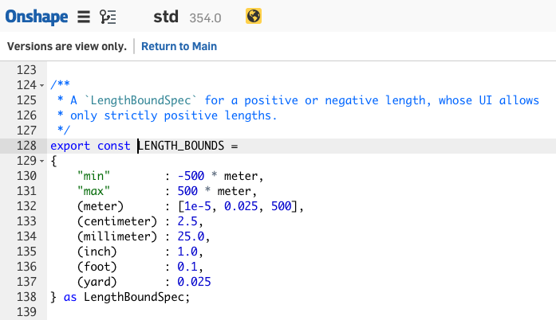

The source code for the valueBounds module includes documentation inside of comments. To see the documentation nicely formatted on its own, you can read about the [`valueBounds` module](https://cad.onshape.com/FsDoc/library.html#module-valueBounds.fs) on the Standard Library documentation page.

By either reading the source code, or reading the documentation for [`LengthBoundSpec`](https://cad.onshape.com/FsDoc/library.html#lengthBoundSpec), we determine that a way of fully customizing the defaults for a length is to define your own `LengthBoundSpec`.

We can now define new bounds for our slot width and our bump height as constants outside the feature:

```javascript
FeatureScript 765;
import(path : "onshape/std/geometry.fs", version : "765.0");

export const SLOT_WIDTH_BOUNDS =
{
    (meter)      : [1e-5, 0.0025, 500],
    (centimeter) : 0.25,
    (millimeter) : 2.5,
    (inch)       : 0.1,
    (foot)       : 0.01,
    (yard)       : 0.0025
} as LengthBoundSpec;

export const BUMP_HEIGHT_BOUNDS =
{
    (meter)      : [1e-5, 0.00025, 500],
    (centimeter) : 0.025,
    (millimeter) : 0.25,
    (inch)       : 0.01,
    (foot)       : 0.001,
    (yard)       : 0.00025
} as LengthBoundSpec;

annotation { "Feature Type Name" : "Slot" }
...
```

...and use them as the bounds of our two length parameters:

```javascript
annotation { "Name" : "Width" }
isLength(definition.width, SLOT_WIDTH_BOUNDS);
```

```javascript
annotation { "Name" : "Bump height" }
isLength(definition.bumpHeight, BUMP_HEIGHT_BOUNDS);
```

> __NOTE__
> 
> The constants `SLOT_WIDTH_BOUNDS` and `BUMP_HEIGHT_BOUNDS` are defined as top-level symbols, which can be used inside this Feature Studio. The export keyword also makes these symbols visible to any module that imports them. It is necessary to export in this case so that the Part Studio referencing this feature has the information needed to create the dialog.

### Narrow the slot path filter
While we're here, we can modify the filter for the slot path to be more specific to prevent unwanted input.

We know we need to extrude in the sketch normal direction, so we can filter out edges that aren't on sketches. We also know that a slot which isn't a line won't fit together with another planar part, so we can also filter out non-linear edges:

```javascript
annotation { "Name" : "Slot path", "Filter" : EntityType.EDGE && SketchObject.YES && GeometryType.LINE, "MaxNumberOfPicks" : 1 }
definition.slotPath is Query;
```

After these changes, the new dialog should look like the one below, with the "Bump height" parameter only appearing when "Add bumps" is checked.

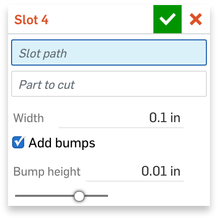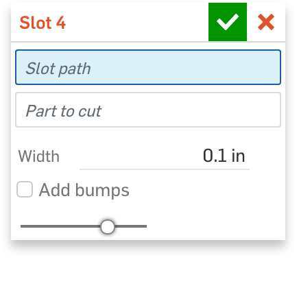

The full code for the new precondition (and bounds) should look as follows:

```javascript
export const SLOT_WIDTH_BOUNDS =
{
    (meter)      : [1e-5, 0.0025, 500],
    (centimeter) : 0.25,
    (millimeter) : 2.5,
    (inch)       : 0.1,
    (foot)       : 0.01,
    (yard)       : 0.0025
} as LengthBoundSpec;

export const BUMP_HEIGHT_BOUNDS =
{
    (meter)      : [1e-5, 0.00025, 500],
    (centimeter) : 0.025,
    (millimeter) : 0.25,
    (inch)       : 0.01,
    (foot)       : 0.001,
    (yard)       : 0.00025
} as LengthBoundSpec;

annotation { "Feature Type Name" : "Slot" }
export const slot = defineFeature(function(context is Context, id is Id, definition is map)
    precondition
    {
        annotation { "Name" : "Slot path", "Filter" : EntityType.EDGE && SketchObject.YES && GeometryType.LINE, "MaxNumberOfPicks" : 1 }
        definition.slotPath is Query;

        annotation { "Name" : "Part to cut", "Filter" : EntityType.BODY && BodyType.SOLID, "MaxNumberOfPicks" : 1 }
        definition.partToCut is Query;

        annotation { "Name" : "Width" }
        isLength(definition.width, SLOT_WIDTH_BOUNDS);

        annotation { "Name" : "Add bumps", "Default" : true }
        definition.addBumps is boolean;

        if (definition.addBumps)
        {
            annotation { "Name" : "Bump height" }
            isLength(definition.bumpHeight, BUMP_HEIGHT_BOUNDS);
        }
    }
...
```

## Calculate the sketch coordinate system
The new geometry needed can't be created using thicken. Instead, we're going to create it using a sketch.

To give ourselves a fresh start, let's begin by removing the old implementation of the Slot feature:

```javascript
    ...
}
{
    opExtrude(context, id + "extrude1", {
           "entities" : definition.slotPath,
           "direction" : evOwnerSketchPlane(context, {"entity" : definition.slotPath}).normal,
           "endBound" : BoundingType.THROUGH_ALL,
           "startBound" : BoundingType.THROUGH_ALL
    });

    opThicken(context, id + "thicken1", {
           "entities" : qCreatedBy(id + "extrude1", EntityType.BODY),
           "thickness1" : definition.width / 2,
           "thickness2" : definition.width / 2
    });

    opDeleteBodies(context, id + "delete1", {
           "entities" : qCreatedBy(id + "extrude1", EntityType.BODY)
    });

    opBoolean(context, id + "boolean1", {
           "tools" : qCreatedBy(id + "thicken1", EntityType.BODY),
           "targets" : definition.partToCut,
           "operationType" : BooleanOperationType.SUBTRACTION
    });
});
```

To create this sketch properly, our first task is to create a cartesian coordinate system defining the position and orientation of the slot. We'll define this coordinate system such that its origin is on one end of the slot, its x-axis is along the slot path, and its z-axis is along the direction we want to extrude, like the one depicted below:

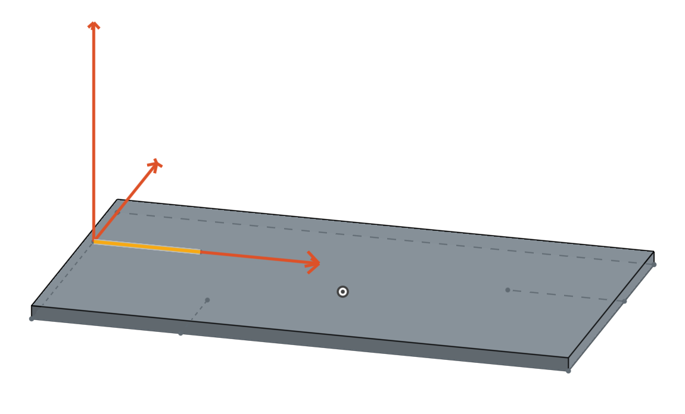

This coordinate system depends on three things: The two endpoints of the slot path, and the sketch plane. We will first evaluate the positions and orientations of these entities, then construct the coordinate system based on these positions.

### Query the line's endpoints
A sketched line will always be its own body in the context. We can find the endpoints on this body with `qVertexAdjacent`, which queries for entities of a given type that (topologically) share a vertex with the `slotPath`.

We'll store this `Query` as a variable named `endPoints`:

```javascript
var endPoints is Query = qVertexAdjacent(definition.slotPath, EntityType.VERTEX);
```

> __NOTE__
> 
> A variable in FeatureScript can optionally be defined with a type constraint (like "`is Query`" above). This will cause a runtime error if that variable is ever set to a value which does not match that type constraint.
> 
> The type constraint is not required, but it can make intent clearer and help find errors sooner.

To test that we've queried for the right thing, we can use the `debug` function. When passed a `Query`, `debug` will highlight all entities matching the `Query` in red.

```javascript
debug(context, endPoints);
```
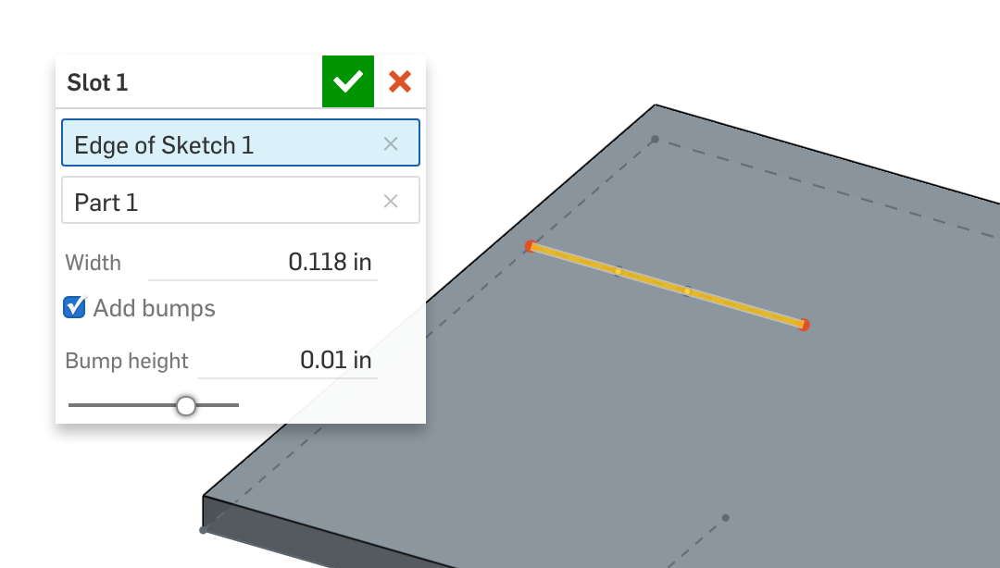

> __NOTE__
> 
> The debug function will __ONLY__ highlight entities when you open the feature dialog of the feature being debugged.

If you open the FeatureScript notices flyout, you should see a line telling you how many entities of each `EntityType` that query resolved to (in this case, two vertices).


Once the debugged output matches the output you expect, you can either delete the debug line, or just comment it out (in case you need it for future debugging).

You can comment any line with the shortcut `Ctrl + /` or `Cmd + /`.

```javascript
// debug(context, endPoints);
```

From here on, any time a call to `debug` or `println` is made, you can assume that you should remove or comment out that call in the final version of the feature.

### Evaluate the endpoint positions
To find the positions of these two endpoints, we can use `evVertexPoint`. To specify the individual entries of the query, we can use `qNthElement`.

```javascript
var startPosition is Vector = evVertexPoint(context, {
        "vertex" : qNthElement(endPoints, 0)
});
var endPosition is Vector = evVertexPoint(context, {
        "vertex" : qNthElement(endPoints, 1)
});
```

> __NOTE__
> 
> FeatureScript has two completely separate ways of representing entities and geometry:
> 
> 1. Queries, like `endPoints` are objects which specify criteria for finding a particular entity or set of entities in the Part Studio. *These are just specifications*, and they contain no information about the geometric or topological properties of any entities. Depending on the context it is evaluated in, a `Query` may resolve to zero, one, or many entities.
> 
> 2. Geometric objects, like `endPosition`, contain data about geometric positions and orientations (including `Vectors`, `Planes`, `CoordSystems`, and more). *These are just data*, and are not contextually associated with any entities in the Part Studio.
> 
> This design gives Onshape Part Studios and features the robust tools needed to maintain fully parametric references.
> 
> To get geometric information from a query, use an evaluation function, found in the [evaluate module](https://cad.onshape.com/FsDoc/library.html#module-evaluate.fs).

> __NOTE__
> 
> `qNthElement`, used above, is a function which returns a `Query` for one of the entities that another `Query` evaluates to.
> 
> In general, the ordering of the elements inside a `Query` is not predictable, so care should be taken to ensure that qNthElement is only used when any ordering of entities will work. In our case, the resulting slot is symmetric, so we are content to define it starting on either end of the line.

A `Vector` just an array of numbers (in this case, with units) which behaves naturally under operators like `+` and `*`. Debugging one of the resulting `Vector`s will print its exact location, in meters, and highlight that point in the Part Studio:

```javascript
debug(context, startPosition);
```

Debugged vertex text Debugged vertex

### Calculate the axis directions
The axes of our coordinate system will be specified as 3D directions – that is, unitless `Vector`s of length 1.

The X-axis can be calculated by normalizing a vector pointing from `startPosition` to `endPosition`:

```javascript
var xDirection is Vector = normalize(endPosition - startPosition);
```

> __NOTE__
> 
> We could have also gotten the X direction from the `slotPath`, by calling `evLine` or `evEdgeTangentLine`. As a rule of thumb, it's better practice to calculate geometric data using information you already have than to call more evaluate functions. This prevents bugs that can occur in edge cases where two seemingly consistent evaluations disagree with each other.

The Z-axis can be calculated by evaluating the sketch plane of the slot path, and taking its normal:

```javascript
var zDirection is Vector = evOwnerSketchPlane(context, {
        "entity" : definition.slotPath
}).normal;
```

### Create a coordinate system and a sketch plane
A `CoordSystem` stores three things: an origin position, a direction for the X-axis, and a perpendicular direction for its Z-axis (the Y-axis can be inferred from the other two axes).

Thus, we can create our desired `CoordSystem` with a single function call:

```javascript
var cSys is CoordSystem = coordSystem(startPosition, xDirection, zDirection);
debug(context, cSys);
```

Debugged coordinate system text Debugged coordinate system

A sketch plane specifies the same information as a coordinate system (the origin and X-direction are specified too, so that sketch entities may be placed accurately). Thus, we can also create a plane in our `CoordSystem` with a single function call.

```javascript
var sketchPlane is Plane = plane(cSys);
The full code to create a coordinate system is below:

var endPoints is Query = qVertexAdjacent(definition.slotPath, EntityType.VERTEX);

var startPosition is Vector = evVertexPoint(context, {
        "vertex" : qNthElement(endPoints, 0)
});
var endPosition is Vector = evVertexPoint(context, {
        "vertex" : qNthElement(endPoints, 1)
});

var xDirection is Vector = normalize(endPosition - startPosition);
var zDirection is Vector = evOwnerSketchPlane(context, {
        "entity" : definition.slotPath
}).normal;

var cSys is CoordSystem = coordSystem(startPosition, xDirection, zDirection);
var sketchPlane is Plane = plane(cSys);
```

## Create a sketch

Sketching in FeatureScript always involves three parts: creating a sketch, adding entities to the sketch, and solving the sketch.

A snippet completing these three steps can be found in the sketch snippets menu, or by simply typing "sketch":

Sketch snippet

This will insert the following code:

```javascript
var sketch1 = newSketch(context, id + "sketch1", {
        "sketchPlane" : qCreatedBy(makeId("Top"), EntityType.FACE)
});
// Create sketch entities here
skSolve(sketch1);
```

Rather than sketching on the top plane (the autocompleted default), let's create our sketch on the sketchPlane we just defined:

```javascript
var sketch1 = newSketch(context, id + "sketch1", {
        "sketchPlane" : sketchPlane
});
```

After committing this change, if we look at the Part Studio, we'll see the slot feature turn red in the feature tree, indicating an error has occurred.

Feature error tooltip

### Diagnose a runtime error
In the FeatureScript notices menu, you can see all errors and warnings displayed. In this case, the issue is a precondition failure:

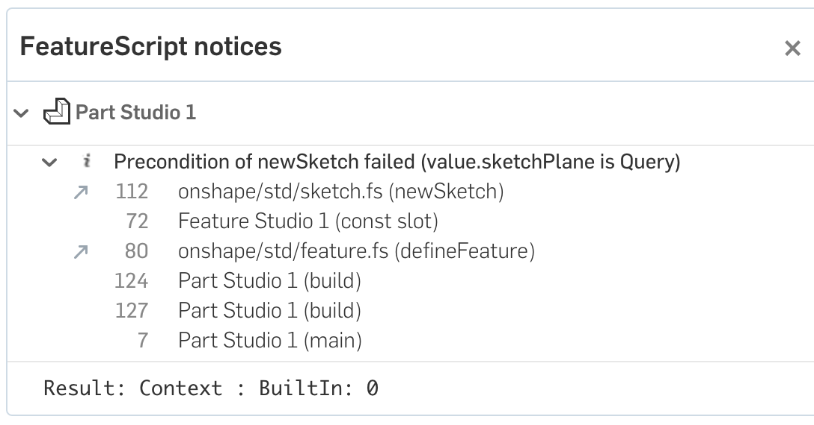

> __NOTE__
> 
> Some errors, like parse errors and mistyped variable names, are detectable inside the Feature Studio without ever running the code. __Runtime errors__, like dynamic type mismatches or dividing by zero, are only found when your code is run inside a Part Studio.
> 
> Some runtime errors (like this one) occur every time a feature runs, but many will only occur in certain contexts with certain inputs. It's generally good practice to maintain a set of Part Studios in the same document that test common cases and edge cases for your feature as you develop. This increases the odds of finding errors and fixing them early.

A precondition failure means that parameters to a function (in this case, the `newSketch` function) have failed to match that function's precondition.

You can see the line of the precondition that failed in parenthesis: `(value.sketchPlane is Query)`.

Another way to get information about the input expected by a function is to hover your mouse over the function name. Documentation will pop up giving you detailed information about what that function does, and what parameters it expects.

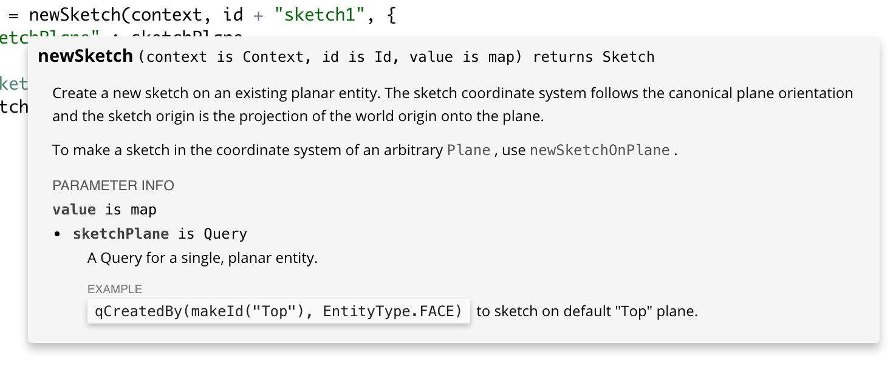

In both the precondition failure message and the hover documentation, we can see that the field `sketchPlane` on the third map parameter is expected to be a `Query`. In the hover documentation, we can also see that if we want to sketch on a `Plane`, we can call `newSketchOnPlane` instead.

Sure enough, we fix this error by changing the function to `newSketchOnPlane`.

```javascript
var sketch1 = newSketchOnPlane(context, id + "sketch1", {
        "sketchPlane" : sketchPlane
});
```

### Sketch a rectangle
Code creating sketch entities will be placed between the sketch creation and the sketch solve. The first entities we need in the sketch will be a rectangle, which will be as long as the slot path.

Let's first define a variable which represents the slot length, calculated as the distance between `startPosition` and `endPosition`.

```javascript
var sketch1 = newSketchOnPlane(context, id + "sketch1", {
        "sketchPlane" : sketchPlane
});
var slotLength is ValueWithUnits = norm(endPosition - startPosition);

skSolve(sketch1);
```

On the line after defining the variable, we can insert code calling `skRectangle` by using autocomplete, or by using the sketch snippets menu.

```javascript
skRectangle(sketch1, "rectangle1", {
        "firstCorner" : vector(0, 0) * inch,
        "secondCorner" : vector(1, 1) * inch
});
```

> __NOTE__
> 
> Every sketch operation has a sketch `id` (here, it's `"rectangle1"`). Unlike feature operation Ids, a sketch id is just a plain string. A sketch `id` needs to be unique within a sketch.

The vectors positioning the corners of the rectangle are 2D length vectors, measured in the coordinate system of the sketch we provided (with the origin at one end of the slot, and the x-axis along the slot).

This means we can easily calculate the precise coordinates needed for the rectangle using the slot width and length.

```javascript
skRectangle(sketch1, "rectangle1", {
        "firstCorner" :  vector(0 * inch,    definition.width / 2),
        "secondCorner" : vector(slotLength, -definition.width / 2)
});
```

This will add a sketch rectangle precisely along your slot path.

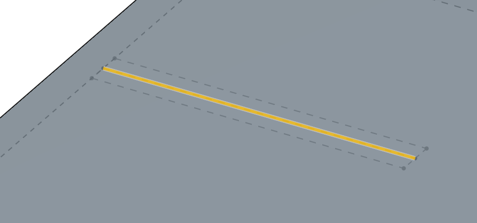

### Sketch slot bumps
We should add bumps to the sketch if (and only if) the user has specified they want bumps.

Insert the autocompletion for, or simply type out, an if statement conditional on the `definition.addBumps` boolean parameter:

```javascript
if (definition.addBumps)
{

}
```

> __NOTE__
> 
> In a FeatureScript `if` statement, the condition inside parenthesis must evaluate to a `boolean`. Otherwise, an error is thrown.

Inside the `if` statement, we can create variables that will help us calculate the positions of arcs that will create the bumps we need.

```javascript
var bumpDistance   = slotLength / 10;          // Distance from end of slot to start of bump
var bumpWidth      = slotLength / 5;
var bumpHeight     = definition.bumpHeight;
```

> NOTE
> 
> Like other control structures in FeatureScript, an `if` statement usually uses a statement block, delimited inside curly braces `{}`. Variables declared inside a statement block can only be used inside that statement block.

We want to create arcs on both sides of our slot. To write less code, we'll use a `for` loop.

```javascript
for (var side in [-1, 1])
{

}
```

> __NOTE__
> 
> A FeatureScript `for` loop can be declared with the syntax above (to iterate through an `array` or `map`), or with the following, more traditional syntax:
> 
> ```javascript
> for (var i = 0; i < count; i += 1)
> ```

Inside the `for` loop, we can define two arcs, one for each end of the slot, using `skArc`. The start, middle, and end points can be calculated from the variables defined above.

```javascript
skArc(sketch1, "arc_0_" ~ side, {
        "start" : vector(bumpDistance, (definition.width / 2) * side),
        "mid" : vector(bumpDistance + bumpWidth / 2, (definition.width / 2 - bumpHeight) * side),
        "end" : vector(bumpDistance + bumpWidth, (definition.width / 2) * side)
});

skArc(sketch1, "arc_1_" ~ side, {
        "start" : vector(slotLength - bumpDistance, (definition.width / 2) * side),
        "mid" : vector(slotLength - bumpDistance - bumpWidth / 2, (definition.width / 2 - bumpHeight) * side),
        "end" : vector(slotLength - bumpDistance - bumpWidth, (definition.width / 2) * side)
});
```

> __NOTE__
> 
> In order to ensure unique sketch ids for both iterations of the `for` loop, the `skArc` ids were both concatenated with the iteration variable `side`.
> 
> The `~` operator will always perform `string` concatenation, converting the values on either side to a `string` representation if necessary.

> __CHALLENGE__
> 
> The two calls to `skArc` above contain a lot of nearly redundant calculations. Try rewriting this code to use two nested `for` loops, and only a single call to `skArc`.

With the arcs added, you should now see the full sketch in your Part Studio.


The full code for creating the sketch is below:

```javascript
var sketch1 = newSketchOnPlane(context, id + "sketch1", {
        "sketchPlane" : sketchPlane
});

var slotLength is ValueWithUnits = norm(endPosition - startPosition);
skRectangle(sketch1, "rectangle1", {
        "firstCorner" :  vector(0 * inch,    definition.width / 2),
        "secondCorner" : vector(slotLength, -definition.width / 2)
});

if (definition.addBumps)
{
    var bumpDistance = slotLength / 10;          // Distance from end of slot to start of bump
    var bumpWidth    = slotLength / 5;
    var bumpHeight   = definition.bumpHeight;

    for (var side in [-1, 1])
    {
        skArc(sketch1, "arc_0_" ~ side, {
                "start" : vector(bumpDistance, (definition.width / 2) * side),
                "mid" : vector(bumpDistance + bumpWidth / 2, (definition.width / 2 - bumpHeight) * side),
                "end" : vector(bumpDistance + bumpWidth, (definition.width / 2) * side)
        });

        skArc(sketch1, "arc_1_" ~ side, {
                "start" : vector(slotLength - bumpDistance, (definition.width / 2) * side),
                "mid" : vector(slotLength - bumpDistance - bumpWidth / 2, (definition.width / 2 - bumpHeight) * side),
                "end" : vector(slotLength - bumpDistance - bumpWidth, (definition.width / 2) * side)
        });
    }
}
skSolve(sketch1);
```

## Extrude a slot from the sketch

The sketch we've created now has five sketch regions. The region we want to extrude is large region in the center. We can query for just that region using `qContainsPoint`.

```javascript
var regionToExtrude = qContainsPoint(qSketchRegion(id + "sketch1"), cSys.origin);
debug(context, regionToExtrude);
```


We can now extrude the sketch region using `opExtrude`, just like in the last tutorial.

```javascript
opExtrude(context, id + "extrude1", {
      "entities" : regionToExtrude,
      "direction" : zDirection,
      "endBound" : BoundingType.THROUGH_ALL,
      "startBound" : BoundingType.THROUGH_ALL
});
```

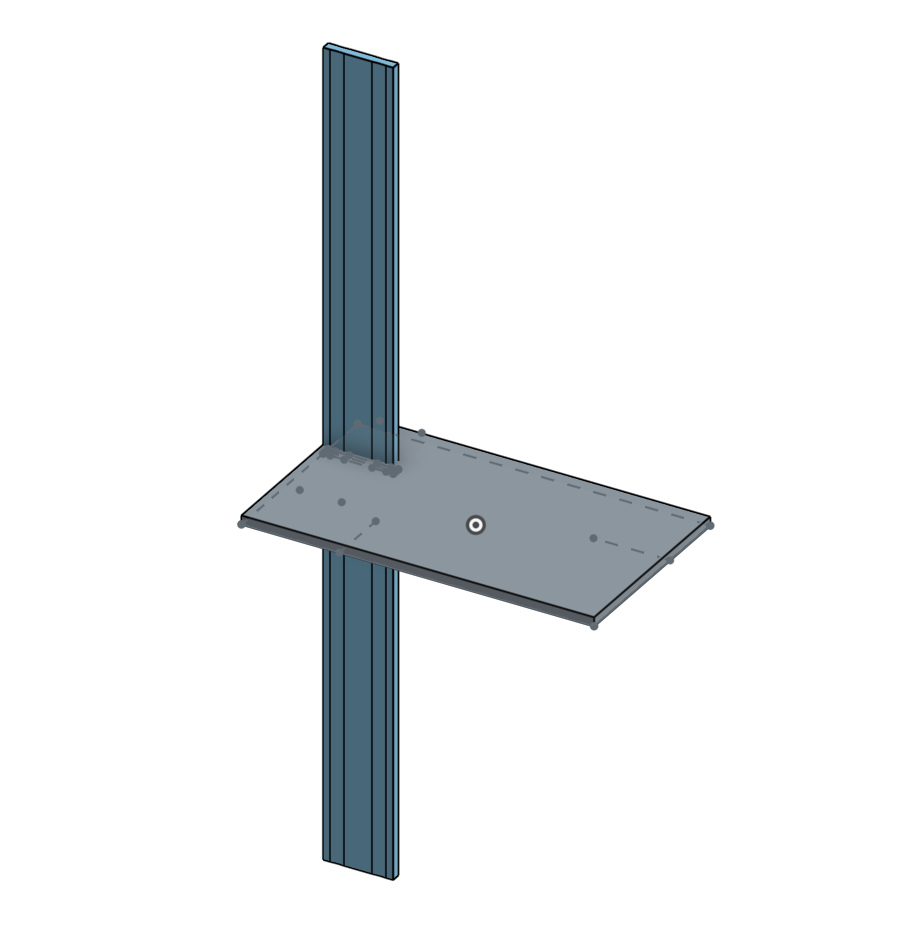

An `opBoolean` will subtract the body:

```javascript
opBoolean(context, id + "boolean1", {
      "tools" : qCreatedBy(id + "extrude1", EntityType.BODY),
      "targets" : definition.partToCut,
      "operationType" : BooleanOperationType.SUBTRACTION
});
```

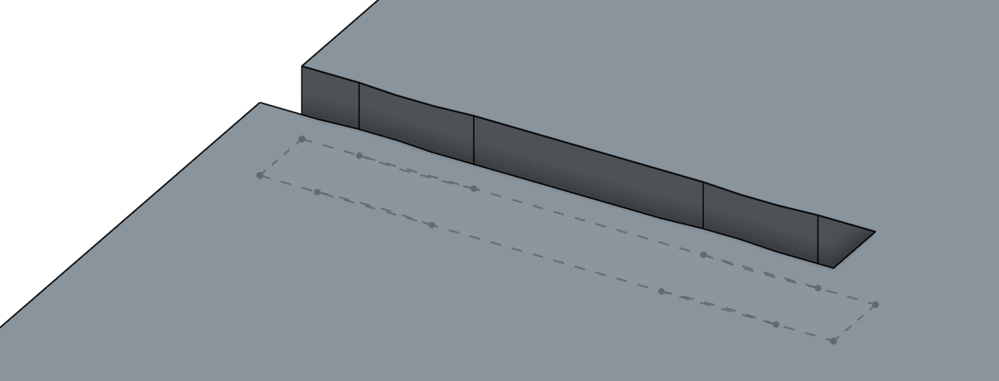

Finally, to clean up, we can delete the sketch bodies used to create the slot.

```javascript
opDeleteBodies(context, id + "delete1", {
      "entities" : qCreatedBy(id + "sketch1", EntityType.BODY)
});
```

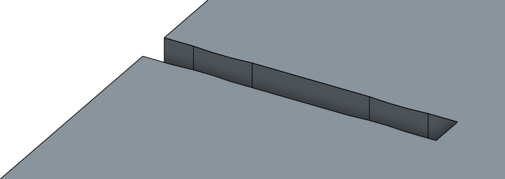

We can use this new slot feature anywhere we used the old feature, and the user now has the option of adding bumps to the slot.

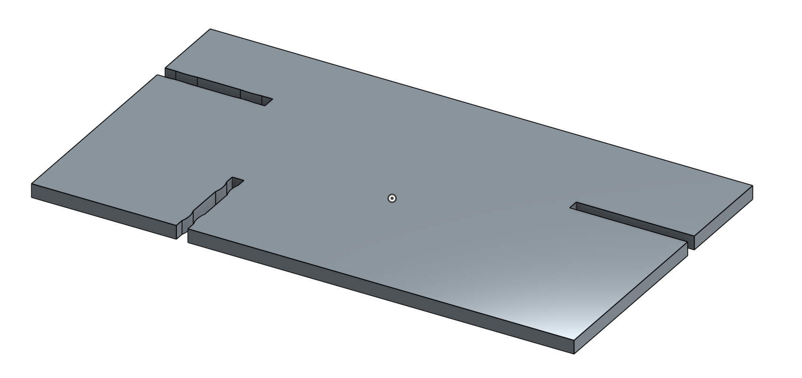

## Review
In this tutorial, we've discussed how to:

 - Add __conditional parameters__ to the precondition
 - Specify a parameter's __UI default__
 - Create FeatureScript __variables__
 - Do math with FeatureScript __`Vectors`__
 - Use a __coordinate system__ to position geometry
 - Create a __sketch__ and add __sketch entities__
 - __Debug__ queries and geometric data
 - Diagnose __runtime errors__
 - Read __hover documentation__
 - Use `Ctrl`-click to __jump to `definition`__
 
## Final feature code

Included here is the final code written in this tutorial. Note that your FeatureScript version and Onshape Standard Library version may be different.

```javascript
FeatureScript 765;
import(path : "onshape/std/geometry.fs", version : "765.0");

export const SLOT_WIDTH_BOUNDS =
{
    (meter)      : [1e-5, 0.0025, 500],
    (centimeter) : 0.25,
    (millimeter) : 2.5,
    (inch)       : 0.1,
    (foot)       : 0.01,
    (yard)       : 0.0025
} as LengthBoundSpec;

export const BUMP_HEIGHT_BOUNDS =
{
    (meter)      : [1e-5, 0.00025, 500],
    (centimeter) : 0.025,
    (millimeter) : 0.25,
    (inch)       : 0.01,
    (foot)       : 0.001,
    (yard)       : 0.00025
} as LengthBoundSpec;

annotation { "Feature Type Name" : "Slot" }
export const slot = defineFeature(function(context is Context, id is Id, definition is map)
    precondition
    {
        annotation { "Name" : "Slot path", "Filter" : EntityType.EDGE && SketchObject.YES && GeometryType.LINE, "MaxNumberOfPicks" : 1 }
        definition.slotPath is Query;

        annotation { "Name" : "Part to cut", "Filter" : EntityType.BODY && BodyType.SOLID, "MaxNumberOfPicks" : 1 }
        definition.partToCut is Query;

        annotation { "Name" : "Width" }
        isLength(definition.width, SLOT_WIDTH_BOUNDS);

        annotation { "Name" : "Add bumps", "Default" : true }
        definition.addBumps is boolean;

        if (definition.addBumps)
        {
            annotation { "Name" : "Bump height" }
            isLength(definition.bumpHeight, BUMP_HEIGHT_BOUNDS);
        }
    }
    {
        var endPoints is Query = qVertexAdjacent(definition.slotPath, EntityType.VERTEX);
        // debug(context, endPoints);

        var startPosition is Vector = evVertexPoint(context, {
                "vertex" : qNthElement(endPoints, 0)
        });
        var endPosition is Vector = evVertexPoint(context, {
                "vertex" : qNthElement(endPoints, 1)
        });
        // debug(context, startPosition);

        var xDirection is Vector = normalize(endPosition - startPosition);
        var zDirection is Vector = evOwnerSketchPlane(context, {
                "entity" : definition.slotPath
        }).normal;

        var cSys is CoordSystem = coordSystem(startPosition, xDirection, zDirection);
        // debug(context, cSys);

        var sketchPlane is Plane = plane(cSys);

        var sketch1 = newSketchOnPlane(context, id + "sketch1", {
                "sketchPlane" : sketchPlane
        });

        var slotLength is ValueWithUnits = norm(endPosition - startPosition);
        skRectangle(sketch1, "rectangle1", {
                "firstCorner" :  vector(0 * inch,    definition.width / 2),
                "secondCorner" : vector(slotLength, -definition.width / 2)
        });

        if (definition.addBumps)
        {
            var bumpDistance = slotLength / 10;          // Distance from end of slot to start of bump
            var bumpWidth    = slotLength / 5;
            var bumpHeight   = definition.bumpHeight;

            for (var side in [-1, 1])
            {
                skArc(sketch1, "arc_0_" ~ side, {
                        "start" : vector(bumpDistance, (definition.width / 2) * side),
                        "mid" : vector(bumpDistance + bumpWidth / 2, (definition.width / 2 - bumpHeight) * side),
                        "end" : vector(bumpDistance + bumpWidth, (definition.width / 2) * side)
                });

                skArc(sketch1, "arc_1_" ~ side, {
                        "start" : vector(slotLength - bumpDistance, (definition.width / 2) * side),
                        "mid" : vector(slotLength - bumpDistance - bumpWidth / 2, (definition.width / 2 - bumpHeight) * side),
                        "end" : vector(slotLength - bumpDistance - bumpWidth, (definition.width / 2) * side)
                });
            }
        }
        skSolve(sketch1);

        var regionToExtrude = qContainsPoint(qSketchRegion(id + "sketch1"), cSys.origin);
        // debug(context, regionToExtrude);

        opExtrude(context, id + "extrude1", {
              "entities" : regionToExtrude,
              "direction" : zDirection,
              "endBound" : BoundingType.THROUGH_ALL,
              "startBound" : BoundingType.THROUGH_ALL
        });

        opBoolean(context, id + "boolean1", {
              "tools" : qCreatedBy(id + "extrude1", EntityType.BODY),
              "targets" : definition.partToCut,
              "operationType" : BooleanOperationType.SUBTRACTION
        });

        opDeleteBodies(context, id + "delete1", {
              "entities" : qCreatedBy(id + "sketch1", EntityType.BODY)
        });
    });
```
