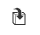

[Back to Slot Tutorials](../)

# Multiple Slots

In this tutorial, we will make a new feature that runs the slot feature created in the tutorials "[Create a slot Feature](../tutorial-1/)" and "[Adding sketch geometry](../tutorial-2/)". This new feature will allow multiple selections for the slot path.

This tutorial will walk through how to:

 - Import another Feature Studio
 - Run another feature
 - Iterate through selected entities
 
We'll also discuss some core FeatureScript concepts along the way, like using variables, doing geometric calculation, debugging geometry, and diagnosing errors.

## Motivation

The Slot feature we made in the last tutorials could only make one slot at a time. The feature that we will make in this tutorial will allow multiple selections, therefore making it easier for the end user.

### Create a feature definition

#### 1

Start by creating another Feature Studio tab in the same Onshape document as you used before:


#### 2

In the Feature Studio, to the left of the "Commit" button, click the "Import" button:


In the box that comes up, select the name of the Feature Studio you made the original slot feature in.

This will import that Feature Studio, making the features defined in it available in the current Feature Studio.

The code that it inserts should look like this, but with different strings of letters and numbers:

```javascript
import(path : "aedb900f50527b09bfa3c0cc", version : "1a06b5a2dec67139b860beec");
```

#### 3

In the Feature Studio, in the top-left corner, click the "New feature" button.

This will insert the following code:

```javascript
annotation { "Feature Type Name" : "My Feature" }
export const myFeature = defineFeature(function(context is Context, id is Id, definition is map)
    precondition
    {
        // Define the parameters of the feature type
    }
    {
        // Define the function's action
    });
```

#### 3

Change the feature type name to `"Multiple Slot"`:

```javascript
annotation { "Feature Type Name" : "Multiple Slot" }
```

#### 4

Select the text `myFeature` on the next line and change it to "`multipleSlot`":

```javascript
export const multipleSlot = defineFeature(function(context is Context, id is Id, definition is map)
```

Your Feature Studio should now look like this (but with a different FeatureScript version and import version):

```javascript
FeatureScript 765;
import(path : "onshape/std/geometry.fs", version : "765.0");

import(path : "aedb900f50527b09bfa3c0cc", version : "1a06b5a2dec67139b860beec");

annotation { "Feature Type Name" : "Multiple Slot" }
export const multipleSlot = defineFeature(function(context is Context, id is Id, definition is map)
    precondition
    {
        // Define the parameters of the feature type
    }
    {
        // Define the function's action
    });
```

#### 5

Copy the code for the Feature UI from the other slot feature and insert it into the precondition block of this Feature Studio.

```javascript
    precondition
    {
        annotation { "Name" : "Slot path", "Filter" : EntityType.EDGE && SketchObject.YES && GeometryType.LINE, "MaxNumberOfPicks" : 1 }
        definition.slotPath is Query;

        annotation { "Name" : "Part to cut", "Filter" : EntityType.BODY && BodyType.SOLID, "MaxNumberOfPicks" : 1 }
        definition.partToCut is Query;

        annotation { "Name" : "Width" }
        isLength(definition.width, SLOT_WIDTH_BOUNDS);

        annotation { "Name" : "Add bumps", "Default" : true }
        definition.addBumps is boolean;

        if (definition.addBumps)
        {
            annotation { "Name" : "Bump height" }
            isLength(definition.bumpHeight, BUMP_HEIGHT_BOUNDS);
        }
    }
```

#### 6

We will now remove the `"MaxNumberOfPicks"` annotation on `definition.slotPath`

The code for `definition.slotPath` should now be this:

```javascript
annotation { "Name" : "Slot path", "Filter" : EntityType.EDGE && SketchObject.YES && GeometryType.LINE, "MaxNumberOfPicks" : 1 }
definition.slotPath is Query;
```

### Define the feature's Behaviour

#### 1

We will use a `for` loop to select which edge to use for the slot to make.

Start typing "for" and select the autocompletion for "For loop".

This will insert the following code:

```javascript
        for (var i = 0; i < count; i += 1)
        {
            
        }
```

#### 2

Press `tab` until the "`count`" input is highlighted and change it to `size(evaluateQuery(context, definition.slotPath))`.

The `evaluateQuery` function will return an `array` of `Queries`, each corresponding to a particular entity in the `Context`.

The `size` function then returns the length of the array.
The reason we do this is so that we know how many lines are selected.

#### 3

Inside the `for` loop, add this line:

```javascript
definition.slotPath = qNthElement(definition.slotPath, i);
```

This sets the `slotPath` to a single edge, rather than many edges.

#### 4

We will now make our "`multipleSlot`" feature call the "`slot`" feature.

Start typing "slot" and select its autocompletion.

```javascript
slot(context, id, definition);
```

Change the text `id` to `id + "slot" + i`.

Commit the Feature Studio, then go to the Part Studio.
Run the "Multiple Slot" feature, and select multiple edges.

You will notice that our multiple slot feature does not work for multiple edges at the moment.

### Troubleshooting when there is no errors

#### 1

Our `for` loop set `definition.slotPath`, which made the next iteration use the new value.

We can fix this by making a new variable for passing into the `slot` feature.

Inside the `for` loop, on the first line, insert a declaration for a variable named `slotDefinition` and set it to `definition`.

```javascript
var slotDefinition = definition;
```

#### 2

Next, change the line `definition.slotPath = qNthElement(definition.slotPath, i);` to `slotDefinition.slotPath = qNthElement(definition.slotPath, i);`, so it uses the new variable.

#### 3

Lastly, change the next line to use the variable `slotDefinition` instead of `definition`.

```javascript
slot(context, id + "slot" + i, slotDefinition);
```

#### 4

You can now commit this feature and it will now work.

We can use this new "Multiple Slot" feature anywhere we used the "Slot" feature, and the user can now make multiple slots in the same feature.

## Review

In this tutorial, we've discussed how to:

 - __Import__ other Feature Studios
 - __Troubleshoot__ with no runtime errors
 - __Reference__ other features
 
## Final feature code

Included here is the final code written in this tutorial. Note that your FeatureScript version and Onshape Standard Library version may be different.

```javascript
FeatureScript 765;
import(path : "onshape/std/geometry.fs", version : "765.0");

import(path : "4f1bf66a78b8c01e6f1ea7f8", version : "931d833e19062ff6e437f652");

annotation { "Feature Type Name" : "Multiple Slot" }
export const multipleSlot = defineFeature(function(context is Context, id is Id, definition is map)
    precondition
    {
        annotation { "Name" : "Slot path", "Filter" : EntityType.EDGE && SketchObject.YES && GeometryType.LINE }
        definition.slotPath is Query;

        annotation { "Name" : "Part to cut", "Filter" : EntityType.BODY && BodyType.SOLID, "MaxNumberOfPicks" : 1 }
        definition.partToCut is Query;

        annotation { "Name" : "Width" }
        isLength(definition.width, SLOT_WIDTH_BOUNDS);

        annotation { "Name" : "Add bumps", "Default" : true }
        definition.addBumps is boolean;

        if (definition.addBumps)
        {
            annotation { "Name" : "Bump height" }
            isLength(definition.bumpHeight, BUMP_HEIGHT_BOUNDS);
        }
    }
    {
        for (var i = 0; i < size(evaluateQuery(context, definition.slotPath)); i += 1)
        {
            var slotDefinition = definition;
            slotDefinition.slotPath = qNthElement(definition.slotPath, i);
            slot(context, id + "slot" + i, slotDefinition);
        }
    });

```
